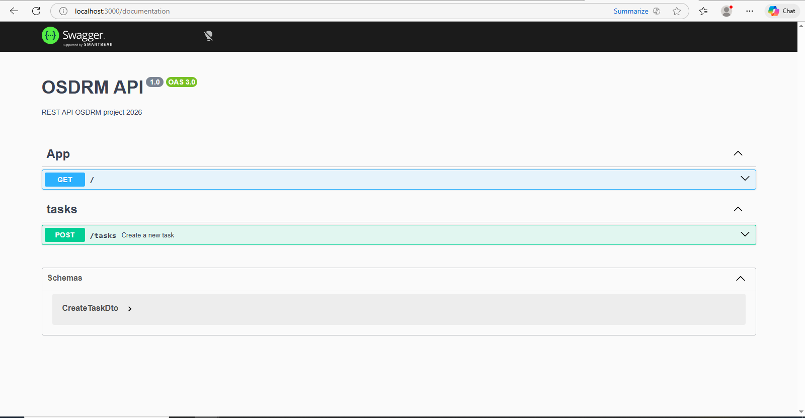

## API Documentation

This project uses **OpenAPI (Swagger)** for API documentation.

### Tools

- **@nestjs/swagger**
- **Swagger UI**
- **OpenAPI Specification**

### Accessing the documentation

Once the application is running, the API documentation is available at: http://localhost:3000/documentation

### Accessing screenshot of swagger ui

